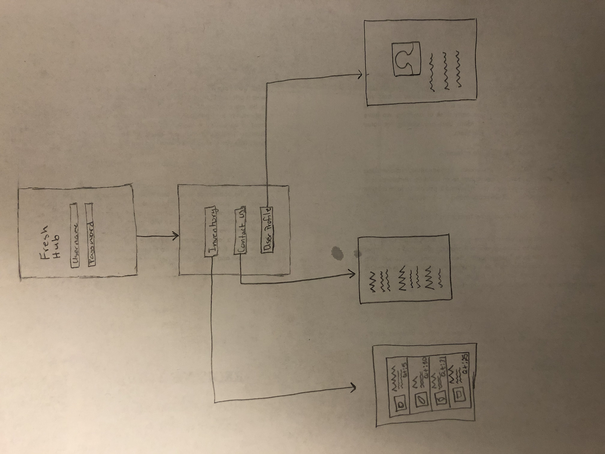
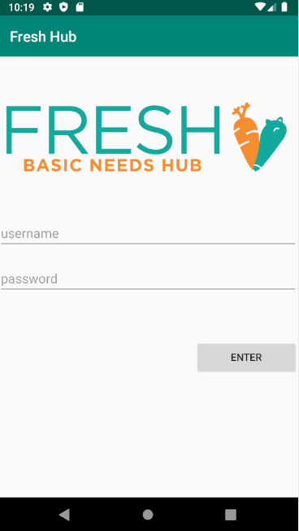
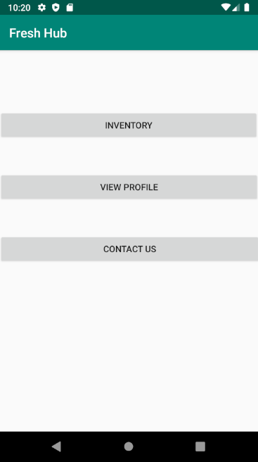
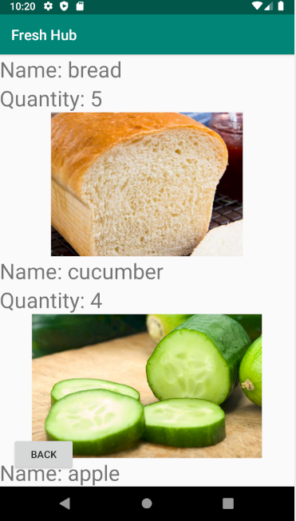
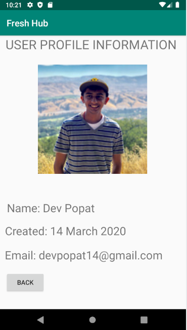
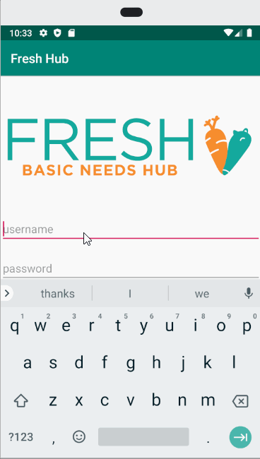
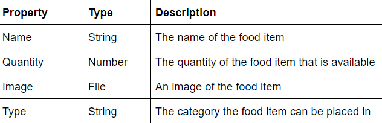
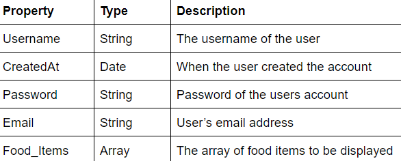
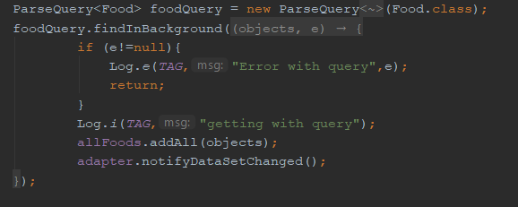
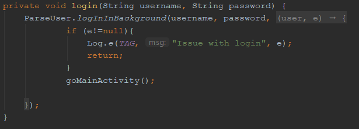

# Group Project - *FreshHub App*
===

## Table of Contents
1. [Team](#Team)
2. [Overview](#Overview)
3. [Product Spec](#Product-Spec)
4. [Wireframes](#Wireframes)
5. [Schema](#Schema)

## Team
Dev Popat: popatd@uci.edu
- Worked on code, and sketches

Malhar Mane: mmane@uci.edu
- Worked on code and sketches

Andres Diaz: adiaz18011@gmail.com
- Worked on code, sketches, and READ.ME

## Overview
### Description
FRESH Basic Needs Hub at UCI is an effort to offer food, toiletries, and off-campus resources to students. There is a building where students can go to access these resources on campus. Freshub app allows students to see what FRESH Basic Needs Hub has available at the moment, provides contact information, and has a cart where they can add the supplies they need.

### App Evaluation
- **Category:** Networking/shopping
- **Mobile:** This app will mainly be used for mobile use as users can see what's available. A version will be available for computers as well that way employees who don’t have access to a mobile device can enter what's currently available. 
- **Story:** A user can go on the app and see what is available at FRESH Basic Needs Hub at UCI, add what they need to their cart, then make the trip to go pick up their items without the risk of not having their wanted items in stock.
- **Market:** Individuals who need assistance financially or with personal matters, they will be able to utilize what FRESH Basic Needs Hub has to offer.
- **Habit:** Users can use this app as often as they go to FRESH Basic Needs Hub to get the supplies and help they need.
- **Scope:** Students who often go to Fresh Hub will greatly benefit from this app, they can check to see if they have what they need. 

## Product Spec
### 1. User Stories (Required and Optional)

- User must be able to create and log into an account
- Display the different products available
- Display user information
- Display contact information

**Optional Nice-to-have Stories**

- Have the products sectioned off into categories
- Have a shopping cart where the user can add the products they’re planning to buy

### 2. Screen Archetypes

- Login
  - The user logs in or registers with an email address in order to gain access to view what is available
- Button Screen
  - Three buttons are displayed for the available items: inventory, contact us, and user profile. Then each button will take the user to a separate screen
- Inventory Screen
  - This will be a recycler view that shows all the available items 
- Contact Us screen 
  - All the contact information will be displayed along with open hours
- User Profile Screen
  - The users information will be displayed here

### 3. Navigation

**Tab Navigation** (Tab to Screen)

- Log in
- Contact Us
- User Information

**Optional**
- Shopping cart
- Categories

**Flow Navigation** (Screen to Screen)
- Login  => After user logs in they are taken to the button page
- Inventory => Taken to a recycler view where available items were displayed
- Contact Us => Text view that shows contact information and open hours
- User Profile => Image and text view that shows the users information

## Wireframes

### [BONUS] Digital Wireframes & Mockups
 
 

### [BONUS] Interactive Prototype

## Schema 
### Models
Food_Item

User

### Networking
Network Request
 - Inventory(Read/Get): Show all available items to user

Parse
 - Login(Read/Get): Get the users username and password

